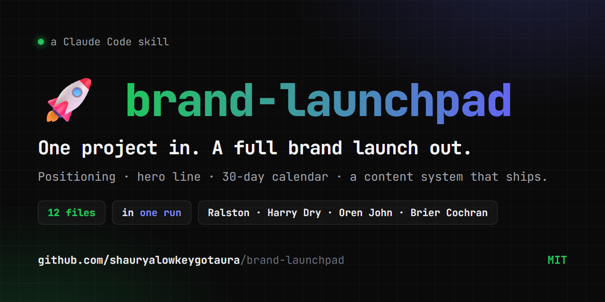

<div align="center">



# 🚀 brand-launchpad

### Name one project. Get a complete brand launch back — in a single Claude Code run.

**12 files. Real frameworks. Zero fluff.** Positioning, hero line, a 30-day calendar, and a content system that actually ships — generated in one pass.

[](LICENSE)
[](https://claude.com/claude-code)
[](https://github.com/shauryalowkeygotaura/brand-launchpad/stargazers)
[](https://github.com/shauryalowkeygotaura/brand-launchpad/pulls)
[](CHANGELOG.md)

[**Install**](#install) · [**What you get**](#what-you-get-from-one-run) · [**Why it's different**](#why-this-is-different) · [**Examples**](examples/)

</div>

---

> Most brand advice hands you a list of tips and tells you to post seven times a week. This is a Claude Code skill instead: name one project, get back twelve files (positioning, hero line, 30-day calendar, a real content system) in a single run, built on frameworks that actually ship.

A reusable [Claude Code](https://claude.com/claude-code) skill that turns
one project (or one person) into a complete brand launch plan in a single
run. Twelve files, real frameworks, no fluff.

> ⭐ **If this saves you a weekend of brand-strategy guesswork, star the repo** — it's the only signal that tells me to keep shipping updates.

## See it run

<!-- TO ADD THE REAL DEMO: record a run, save it as assets/demo.png (or demo.gif),
     then delete this comment and the two HTML-comment markers around the line below. -->
<!--  -->

One prompt in, twelve files out:

```text
You ▸ build a brand for my SaaS "Inboxly"

Claude ▸ Using brand-launchpad…
  ✓ brand-journey.md      reverse-engineered from your 12-month outcome
  ✓ positioning.md        "Inboxly is the inbox that answers itself."
  ✓ hero-line.md          3-rule tested · 12 words · 21 rewrites logged
  ✓ recurring-series.md   5 named series + banners
  ✓ 30-day-plan.md        Day 1 … Day 30, dated, with a Day-21 proof milestone
  … 7 more files written to Projects/inboxly/brand/
```

## Install

Drop the skill into your Claude Code skills directory:

```bash
# macOS / Linux
mkdir -p ~/.claude/skills/brand-launchpad
curl -L https://raw.githubusercontent.com/shauryalowkeygotaura/brand-launchpad/main/SKILL.md \
  -o ~/.claude/skills/brand-launchpad/SKILL.md
```

```powershell
# Windows
New-Item -ItemType Directory -Force "$env:USERPROFILE\.claude\skills\brand-launchpad"
Invoke-WebRequest `
  -Uri "https://raw.githubusercontent.com/shauryalowkeygotaura/brand-launchpad/main/SKILL.md" `
  -OutFile "$env:USERPROFILE\.claude\skills\brand-launchpad\SKILL.md"
```

Then in any Claude Code session:

```
build a brand for <project>
```

The skill auto-activates.

## What you get from one run

Twelve files in `Projects/<name>/brand/`:

```
brand-journey.md       ← reverse-engineered from 12-month outcome
associations.md        ← what to pair with, what to refuse
positioning.md         ← single positioning sentence + counterposition list
brand-kit.md           ← colors, fonts, trademark visual tic
handles.md             ← reality-checked handle architecture
hero-line.md           ← 12-word max, 3-rule tested, 20+ rewrite trail
formats.md             ← 3 native formats + source-artifact pipeline + visual variety
recurring-series.md    ← 4 to 6 named series with banners
content-mix.md         ← 4:2:1 funnel, applied to source artifacts
ideation-faucets.md    ← 4 permanent idea sources, populated for your niche
30-day-plan.md         ← absolute dates, Day-21 proof milestone
operating-rules.md     ← energy + standards + film-day rules
```

Every file is real markdown you act on, not a "framework PDF".

## Sources baked in

| Source | What's pulled in |
|--------|------------------|
| Caleb Ralston brand course (6h) | Brand journey, associations, positioning gap, vulnerability rule |
| Oren John living-portfolio (29 min) | 3-format lock, audience-of-10, cadence floors, studio-vs-personal split |
| Harry Dry copywriting (76 min) | 3-rule hero-line test, Kaplan's law, conflict-per-sentence |
| Brier Cochran 100k content 2026 | 4:2:1 funnel split, ideation faucets, counterposition, untangling data |
| Internal signal-over-cadence rework | Source-artifact pipeline, two-handle architecture, Day-21 proof milestone, named recurring series, 4-surface visual variety floor |

## Why this is different

| Most brand advice | brand-launchpad |
|-------------------|-----------------|
| "Post 7 unique topics a week" | 1 to 2 real source artifacts feed 5 to 12 derivatives |
| "Build a personal brand" (vague) | Pick 1 of 7 variants (personal / studio / product / service / OSS / newsletter / podcast) before Step 1 |
| "Use good hooks" | Harry's 3-rule test (visualize / falsify / nobody else) with pass/fail table |
| "Be authentic" | Two-handle architecture: main feed polished, B-side `@brand.notes` is the lab notebook |
| Output: a list of tips | Output: 12 files you act on |
| "Just keep posting" | Day-21 real-deployment milestone runs in parallel with the posting plan |
| "Find your visual style" | 4-surfaces-per-week variety floor with explicit menu |
| One-off post advice | 4 to 6 named recurring series, each with banner + rules |

## When to use this

- You finished building a product and don't know how to get attention
- You have a working project but its brand reads as generic
- You're starting a personal brand from zero
- You're rebooting a brand that's drifted off through-line
- You're an agency / freelancer trying to package yourself differently from peers

## When NOT to use this

- You need ad-account audits — use a paid-ads skill instead
- You need ad copy variations — use an ad-creative skill instead
- You need one-off social posts — use a post-writing skill instead
- You want a "what should I tweet today" generator — wrong tool

## Examples

See [`examples/`](examples/) for representative runs across brand types:

- [SaaS product example](examples/saas-product-example.md)
- [Service business example](examples/service-business-example.md)
- [Open-source tool example](examples/oss-tool-example.md)
- [Newsletter example](examples/newsletter-example.md)

## Process (full detail)

The full 11-step process is in [SKILL.md](SKILL.md). Highlights:

- **Step 1**: Caleb's 4-question brand journey (reverse-engineered from outcome)
- **Step 3**: Positioning sentence with counterposition list. Position by
  thinking, not by demographic.
- **Step 4b**: Handle reality check on every platform before locking brand kit
- **Step 5**: Hero line, 3-rule tested, max 12 words, 20+ rewrite trail
- **Step 6b**: Source-artifact pipeline — 1 real event becomes 5 to 12 posts
- **Step 6c**: 4 to 6 named recurring series with first-2-second banners
- **Step 9**: Day-21 real-deployment milestone for service/product brands

## Contributing

PRs welcome — especially new brand-type variants and real-world example runs. Fork, branch, and open a PR. If you ship a brand with this, open an issue with the link; the best ones go in `examples/`.

## ⭐ Star this repo

If brand-launchpad gave you a usable plan, **a star is the fastest way to say thanks** — and it's how other builders discover the skill. No newsletter, no signup. Just the star.

<div align="center">

[](https://star-history.com/#shauryalowkeygotaura/brand-launchpad&Date)

</div>

## Status

v1.0.0 released 2026-05-29. See [CHANGELOG.md](CHANGELOG.md).

## License

[MIT](LICENSE). Use it, fork it, ship better brand plans.

## Credit

Built by [@shauryalowkeygotaura](https://github.com/shauryalowkeygotaura). Sources
attributed inline.

#claude-code #claude-skill #personal-brand #content-strategy #brand-strategy
